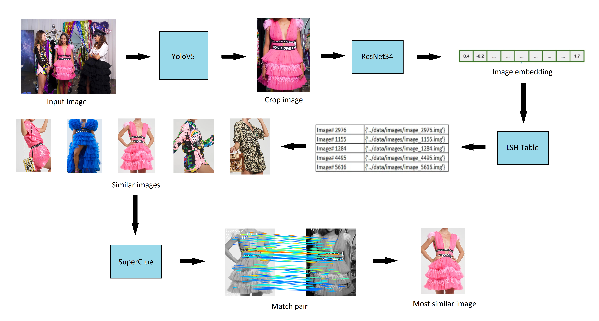
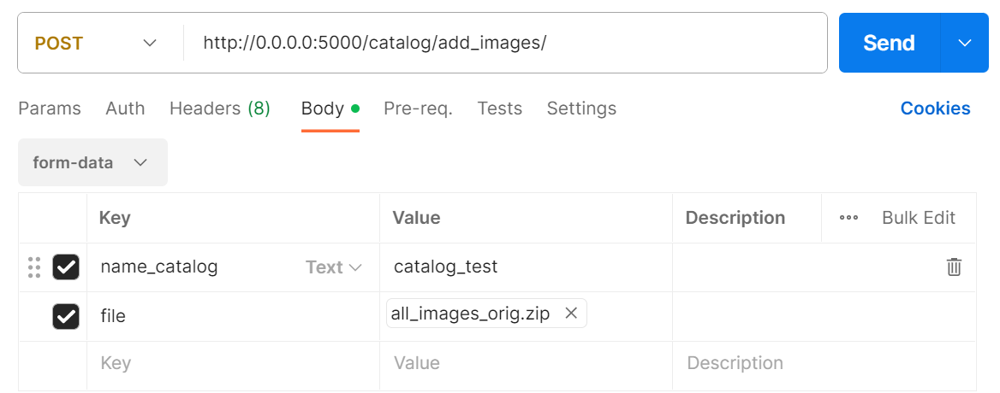
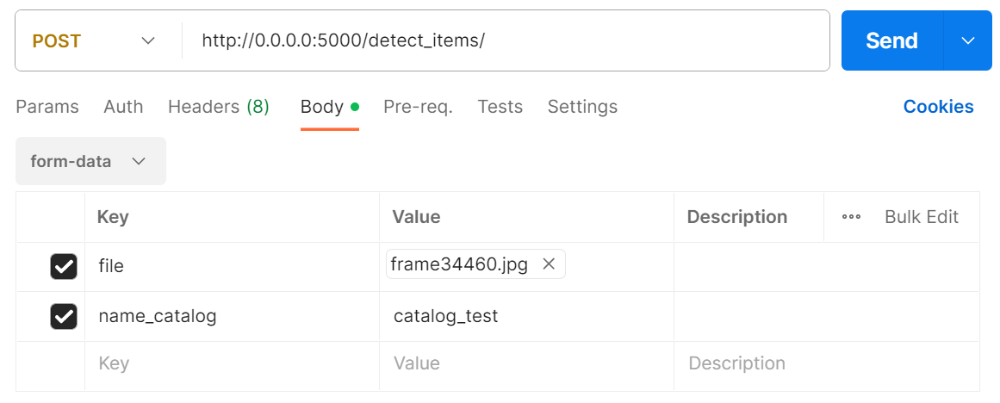
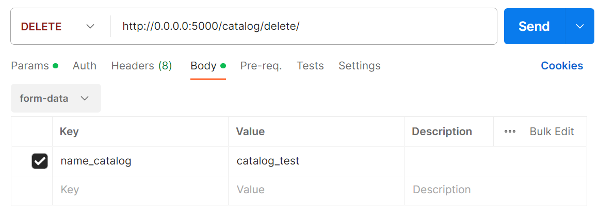

# Система поиска идентичного изображения

Цель разработки прототипа состоит в поиске индентичных товаров из фиксированного каталога по кадрам видеозаписи в режиме реального времени.


## Предварительная подготовка

1. Обучаем модель Yolov5 на распознавание объектов определенного типа, например, одежды. Обученная модель с высокой скоростью позволит извлечь кропы одежды из каталога и входного изображения для более точного сравнения.

2. Обучаем модель ResNet34 на каталоге товаров. Используем модель для получения эмбеддинга, представления изображения в векторизованной форме, где похожие изображения также близки по пространственному измерению.

3. Индексируем базу изображений. Индексирование представляет из себя прогон обученной модели ResNet34 на всех изображениях и запись эмбеддингов в специальный индекс для быстрого поиска. Сравнение входного изображения и всей базы данных, которая может содержать несколько сотен или тысяч изображений, требует значительных вычислительных ресурсов для поиска похожих изображений. Для этого используется метод LSH, который представляет собой приближенный алгоритм ближайшего соседа, работающий за логарифмическую сложность.

## Алгоритм поиска идентичного изображения

1. Извлекаем кропы входного изображения с помощью модели Yolov5.

2. Каждый кроп преобразуется в эмбеддинг с использованием обученной модели ResNet34.

3. Сравнение данного эмбеддинга с остальными в базе. Результатом поиска является отсортированная по релевантности выдача из нескольких изображений товаров.

4. Далее среди полученной небольшой выборки изображений методом ключевых точек находим наиболее похожее изображение. Ряд признаков извлекается из изображения таким образом, что гарантируется повторное распознавание одних и тех же признаков даже при вращении, масштабировании или наклоне. Для этого применяется SuperGlue, детектор ключевых точек с их сопоставлением.

5. Изображение товара из базы с высокой долей признаков, совпадающих с входным изображением, считается идентичным изображением.



## Подготовка и запуск проекта на сервере

Обновление зависимостей и установка python:

```
sudo apt update
sudo apt install python3-pip
```

Установка необходимых библиотек:

```
pip install -r requirements.txt
```

Установка gunicorn:

```
sudo apt install gunicorn
```

Cоздайте .env файл и впишите ACCESS_KEY и SECRET_KEY для доступа к хранилищу S3 AWS.

Запуск проекта:

```
gunicorn -w 5 -b 0.0.0.0:5000 flask_api_sp:app --timeout 90 --daemon
```

### Примеры запросов

Создание каталога и загрузка изображений товара:



Распознавание товаров из каталога во входном изображении:



Удаление каталога:


